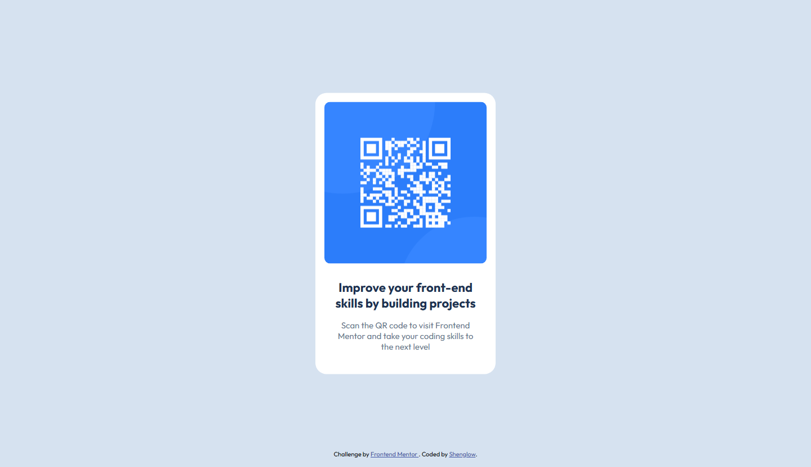

# Frontend Mentor - QR code component solution

This is a solution to the [QR code component challenge on Frontend Mentor](https://www.frontendmentor.io/challenges/qr-code-component-iux_sIO_H). Frontend Mentor challenges help you improve your coding skills by building realistic projects.

## Table of contents

- [Overview](#overview)
  - [Screenshot](#screenshot)
  - [Links](#links)
- [My process](#my-process)
  - [Built with](#built-with)
  - [What I learned](#what-i-learned)

## Overview

### Screenshot



### Links

[Live Demo](https://shenglow.github.io/qr-code-component/)

## My process

### Built with

- Semantic HTML5 markup
- CSS custom properties

### What I learned

Implementing this project reminded me that I should declare CSS variables in the :root pseudo-element instead of in the body element. This is more specific and logical.

```css
:root {
  --white: hsl(0, 0%, 100%);
  --slate-300: hsl(212, 45%, 89%);
  --slate-500: hsl(216, 15%, 48%);
  --slate-900: hsl(218, 44%, 22%);
  --font-family: "Outfit", serif;
  --font-normal: 400;
  --font-bold: 700;
  --font-body1: 22px;
  --font-body2: 15px;
  --spacing: 16px;
  --spacing-l: 24px;
  --spacing-xl: 40px;
}
```
